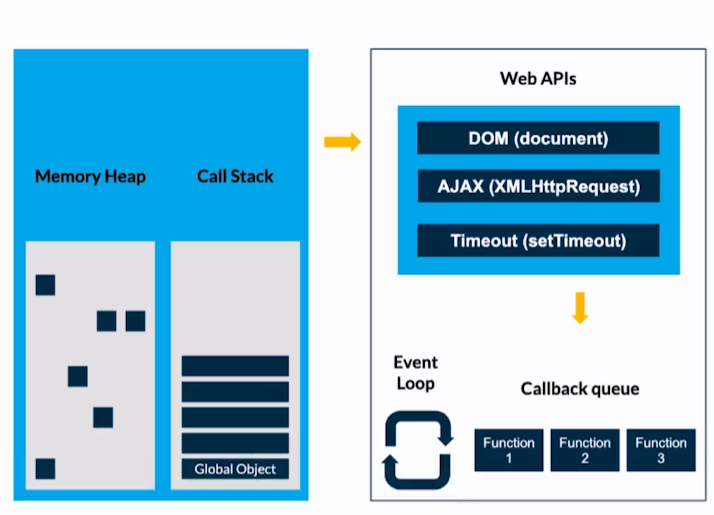

# <span style="color: #98ED7B; font-weight: bold;">Javascript Learning</span>
Repositorio enfocado a almacenar el conocimiento adquirido durante diversos cursos de JavaScript. 

JavaScript es un lenguaje de programación interpretado y dinámico que se utiliza principalmente en la creación de aplicaciones web. Fue <b>creado en 1995</b> por la empresa <b>Netscape Communications</b> Corporation, especificamente por <b>Brendan Eich</b>, con el nombre <b>Mocha</b> y se convirtió rápidamente en el lenguaje de programación más popular para el desarrollo de aplicaciones web.

A principios de la década de 2000, JavaScript se convirtió en un estándar de facto en la industria del desarrollo web y fue adoptado por la mayoría de los navegadores web. En 2002, JavaScript fue renombrado como ECMAScript para poder ser considerado un estándar internacional y se ha seguido desarrollando y mejorando desde entonces.

En la actualidad, JavaScript es uno de los lenguajes de programación más utilizados y es fundamental para la creación de aplicaciones web modernas y dinámicas. Se utiliza en una amplia variedad de aplicaciones, desde sitios web y aplicaciones móviles hasta aplicaciones de escritorio y juegos.

En resumen, JavaScript fue creado en 1995 por la empresa Netscape Communications Corporation y se ha convertido en uno de los lenguajes de programación más utilizados en la industria del desarrollo web. Fue renombrado como ECMAScript en 2002 y ha seguido desarrollándose y mejorando desde entonces.
# <span style="color: #98ED7B; font-weight: bold;">Índice</span>
- [Javascript Learning](#javascript-learning)
- [Índice](#índice)
- [Información del lenguaje](#información-del-lenguaje)
  - [Scope](#scope)
  - [Hoisting](#hoisting)
  - [Coerción](#coerción)
  - [Truthy and Falsy](#truthy-and-falsy)
  - [Some array methods](#some-array-methods)
    - [pop](#pop)
    - [unshift](#unshift)
    - [shift](#shift)
    - [push](#push)
    - [spread operator](#spread-operator)
    - [filter](#filter)
    - [map](#map)
    - [find](#find)
    - [forEach](#foreach)
    - [some](#some)
  - [Loops](#loops)
    - [for](#for)
    - [for/in](#forin)
    - [for/of](#forof)
    - [while](#while)
    - [do/while](#dowhile)
- [Engine V8](#engine-v8)
  - [Funcionamiento](#funcionamiento)
    - [Detalles](#detalles)
  - [Hoisting en Engine V8](#hoisting-en-engine-v8)
  - [Global, Window y this](#global-window-y-this)
  - [Memory Heap y call stack](#memory-heap-y-call-stack)
    - [Interacción](#interacción)
  - [Garbage Collection](#garbage-collection)
    - [Funcionamiento](#funcionamiento-1)
  - [Stack Overflow](#stack-overflow)
  - [JavaScript Runtime](#javascript-runtime)
  - [JavaScript Asynchronous](#javascript-asynchronous)

# <span style="color: #98ED7B; font-weight: bold;">Información del lenguaje</span>
## <span style="color: #7FC767; font-weight: bold;">Scope</span>
El scope es el espacio de ejecucion de un codigo, puede ser local o global:
```javascript
var cosa = "cosa global";

console.log("Antes de scope global: ", cosa);

function other_scope(){
    console.log("Antes de scope local: ", cosa);
    var cosa = "cosa local";
    console.log("Despues de scope local: ", cosa);
};

other_scope();

console.log("Despues de scope global: ", cosa);
```
Retorna:
```
Antes de scope global:  cosa global
Antes de scope local:  undefined
Despues de scope local:  cosa local
Despues de scope global:  cosa global
```
[Volver al Índice 🔝](#índice)
## <span style="color: #7FC767; font-weight: bold;">Hoisting</span>
Hoisting es un término para describir que las declaraciones de variables y funciones son desplazadas a la parte superior del scope más cercano, scope global o de función. Esto sucede solamente con las declaraciones y no con las asignaciones.:
```javascript
console.log("Hoisting 1: ", cosa);

do_something();

function do_something(){
    console.log("Hoisting 2: ", cosa);
};

var cosa = "Texto asignado";
```
Retorna:
```
Hoisting 1:  undefined
Hoisting 2:  undefined
```
[Volver al Índice 🔝](#índice)
## <span style="color: #7FC767; font-weight: bold;">Coerción</span>
Coerción es la forma en la que podemos cambiar un tipo de valor a otro, existen dos tipos de coerción: <br>
- Coerción implícita = Es cuando el lenguaje nos ayuda a cambiar el tipo de valor.
    ``` javascript
    // Coerción implícita
    var cosa_1 = 1 + "";
    var cosa_2 = 1 + "0";
    var cosa_3 = 1 + "1";
    var cosa_4 = 1 + "2";
    var cosa_5 = 1 + "3";

    console.log("Implícita, Caso 1: ", cosa_1);
    console.log("Implícita, Caso 2: ", cosa_2);
    console.log("Implícita, Caso 3: ", cosa_3);
    console.log("Implícita, Caso 4: ", cosa_4);
    console.log("Implícita, Caso 5: ", cosa_5);
    ```
    Retorna:
    ```
    Implícita, Caso 1:  1
    Implícita, Caso 2:  10
    Implícita, Caso 3:  11
    Implícita, Caso 4:  12
    Implícita, Caso 5:  13
    ```
- Coerción explicita = Es cuando obligamos a que cambie el tipo de valor.
    ```javascript
    // Coerción explicita

    var cosa_1 = 1 + Number("");
    var cosa_2 = String(1) + "0";
    var cosa_3 = 1 + Number("1");
    var cosa_4 = 1 + Number("2");
    var cosa_5 = 1 + Number("3");

    console.log("Explicita, Caso 1: ", cosa_1);
    console.log("Explicita, Caso 2: ", cosa_2);
    console.log("Explicita, Caso 3: ", cosa_3);
    console.log("Explicita, Caso 4: ", cosa_4);
    console.log("Explicita, Caso 5: ", cosa_5);
    ```
    Retorna:
    ```
    Explicita, Caso 1:  1
    Explicita, Caso 2:  10
    Explicita, Caso 3:  2
    Explicita, Caso 4:  3
    Explicita, Caso 5:  4
    ```
[Volver al Índice 🔝](#índice)
## <span style="color: #7FC767; font-weight: bold;">Truthy and Falsy</span>
Valores que por default son falsos o verdaderos.
- Ejemplos en los que Boolean devuelve Falso:
    ```javascript
    Boolean(0); //false
    Boolean(null); //false
    Boolean(NaN); //false
    Boolean(undefined); //false
    Boolean(false); //false
    Boolean(""); //false
    ```

- Ejemplos en los que Boolean devuelve verdadero:
    ```javascript
    Boolean(1); //true para 1 o cualquier número diferente de cero (0)
    Boolean("a"); //true para cualquier caracter o espacio en blanco en el string
    Boolean([]); //true aunque el array esté vacío
    Boolean({}); //true aunque el objeto esté vacío
    Boolean(function(){}); //Cualquier función es verdadera también
    ```
[Volver al Índice 🔝](#índice)
## <span style="color: #7FC767; font-weight: bold;">Some array methods</span>
### <span style="color: #67A154; font-weight: bold;">pop</span>
Elimina el último elemento de un array y lo devuelve. Si el array está vacío, se devuelve undefined y no se modifica.
```javascript
let example_array_1 = ["Doom", "Stalker", "Half-Life", "Oblivion", "Fallout"];
console.log("Array: ", example_array_1);
let element_1 = example_array_1.pop();
console.log("Array pop(): ", example_array_1);
console.log("Element: ", element_1);
```
Retorna:
```
Array:  [ 'Doom', 'Stalker', 'Half-Life', 'Oblivion', 'Fallout' ]
Array pop():  [ 'Doom', 'Stalker', 'Half-Life', 'Oblivion' ]
Element:  Fallout
```
[Volver al Índice 🔝](#índice)
### <span style="color: #67A154; font-weight: bold;">unshift</span>
Inserta nuevos elementos al comienzo de un array y devuelve la nueva longitud del array.
```javascript
let example_array_2 = ["Doom", "Stalker", "Half-Life", "Oblivion", "Fallout"];
console.log("Array: ", example_array_2);
let element_2 = example_array_2.unshift("Rust");
console.log("Array unshift('Rust'): ", example_array_2);
console.log("Element: ", element_2);
```
Retorna:
```
Array:  [ 'Doom', 'Stalker', 'Half-Life', 'Oblivion', 'Fallout' ]
Array unshift('Rust'):  [ 'Rust', 'Doom', 'Stalker', 'Half-Life', 'Oblivion', 'Fallout' ]
Element:  6
```
[Volver al Índice 🔝](#índice)
### <span style="color: #67A154; font-weight: bold;">shift</span>
Elimina el primer elemento de un array y lo devuelve. Si el array está vacío, se devuelve undefined y no se modifica.
```javascript
let example_array_3 = ["Doom", "Stalker", "Half-Life", "Oblivion", "Fallout"];
console.log("Array: ", example_array_3);
let element_3 = example_array_3.shift();
console.log("Array shift(): ", example_array_3);
console.log("Element: ", element_3);
```
Retorna:
```
Array:  [ 'Doom', 'Stalker', 'Half-Life', 'Oblivion', 'Fallout' ]
Array shift():  [ 'Stalker', 'Half-Life', 'Oblivion', 'Fallout' ]
Element:  Doom
```
[Volver al Índice 🔝](#índice)
### <span style="color: #67A154; font-weight: bold;">push</span>
Agrega nuevos elementos al final de un array y devuelve la nueva longitud del array.
```javascript
let example_array_4 = ["Doom", "Stalker", "Half-Life", "Oblivion", "Fallout"];
console.log("Array: ", example_array_4);
let element_4 = example_array_4.push("Factorio");
console.log("Array push('Factorio')): ", example_array_4);
console.log("Element: ", element_4);
```
Retorna:
```
Array:  [ 'Doom', 'Stalker', 'Half-Life', 'Oblivion', 'Fallout' ]
Array push('Factorio')):  [ 'Doom', 'Stalker', 'Half-Life', 'Oblivion', 'Fallout', 'Factorio' ]
Element:  6
```
[Volver al Índice 🔝](#índice)
### <span style="color: #67A154; font-weight: bold;">spread operator</span>
La sintaxis spread ( ...) permite que un iterable, como un array o cadena, se expanda en lugares donde se esperan cero o más argumentos (para llamadas a funciones) o elementos (para literales de array). En un objeto literal, la sintaxis extendida enumera las propiedades de un objeto y agrega los pares clave-valor al objeto que se está creando.
```javascript
let example_array_5 = ["Doom", "Stalker", "Half-Life", "Oblivion", "Fallout"];
console.log("Array: ", example_array_5);
let new_example_array_5 = ["Starcraft", ...example_array_5, "Warcraft"]
console.log("Array (...): ", new_example_array_5);
console.log("Array: ", example_array_5);
```
Retorna:
```
Array:  [ 'Doom', 'Stalker', 'Half-Life', 'Oblivion', 'Fallout' ]
Array (...):  [
  'Starcraft',
  'Doom',
  'Stalker',
  'Half-Life',
  'Oblivion',
  'Fallout',
  'Warcraft'
]
Array:  [ 'Doom', 'Stalker', 'Half-Life', 'Oblivion', 'Fallout' ]
```
[Volver al Índice 🔝](#índice)
### <span style="color: #67A154; font-weight: bold;">filter</span>
Devuelve los elementos de un array que cumplen la condición especificada en una función de devolución de llamada.
```javascript
let videogames = [
    { nombre: "The Legend of Zelda: Breath of the Wild", precio: 59.99 },
    { nombre: "Super Mario Odyssey", precio: 49.99 },
    { nombre: "Red Dead Redemption 2", precio: 59.99 },
    { nombre: "God of War", precio: 49.99 },
    { nombre: "Uncharted 4: A Thief's End", precio: 39.99 },
    { nombre: "Overwatch", precio: 39.99 },
    { nombre: "Fortnite", precio: 0 },
    { nombre: "Minecraft", precio: 26.95 },
    { nombre: "Grand Theft Auto V", precio: 29.99 },
    { nombre: "The Witcher 3: Wild Hunt", precio: 19.99 },
    { nombre: "Call of Duty: Modern Warfare", precio: 59.99 },
    { nombre: "Tom Clancy's Rainbow Six Siege", precio: 19.99 },
    { nombre: "Destiny 2", precio: 0 },
    { nombre: "Fallout 76", precio: 39.99 },
    { nombre: "Battlefield 1", precio: 19.99 }
];
let videogames_filtered = videogames.filter(element => element.nombre.toLowerCase().includes("u"));
console.log("Array Filtered: ", videogames_filtered);
```
Retorna:
```
Array Filtered:  [
  { nombre: 'Super Mario Odyssey', precio: 49.99 },
  { nombre: "Uncharted 4: A Thief's End", precio: 39.99 },
  { nombre: 'Grand Theft Auto V', precio: 29.99 },
  { nombre: 'The Witcher 3: Wild Hunt', precio: 19.99 },
  { nombre: 'Call of Duty: Modern Warfare', precio: 59.99 },
  { nombre: 'Fallout 76', precio: 39.99 }
]
```
[Volver al Índice 🔝](#índice)
### <span style="color: #67A154; font-weight: bold;">map</span>
Llama a una función de devolución de llamada definida en cada elemento de un array y devuelve otro array que contiene los resultados.
```javascript
let videogames_mapped = videogames.map(element => element.nombre.toLowerCase().includes("u"));
console.log("Array Mapped: ", videogames_mapped);
```
Retorna:
```
Array Mapped:  [
  false, true,  false,
  false, true,  false,
  false, false, true,
  true,  true,  false,
  false, true,  false
]
```
[Volver al Índice 🔝](#índice)
### <span style="color: #67A154; font-weight: bold;">find</span>
Devuelve el valor del primer elemento del array donde el predicado es verdadero y undefined en caso contrario.
```javascript
let videogame_find = videogames.find(element => element.nombre.toLowerCase().includes("u"));
console.log("Array Find: ", videogame_find);
```
Retorna:
```
Array Find:  { nombre: 'Super Mario Odyssey', precio: 49.99 }
```
[Volver al Índice 🔝](#índice)
### <span style="color: #67A154; font-weight: bold;">forEach</span>
Realiza la acción especificada para cada elemento del array.
```javascript
let videogames_new = [];
videogames.forEach(function(element){
    if (element.nombre.toLowerCase().includes("u")) {
        videogames_new = [...videogames_new, element];
    }
});
console.log("Array forEach: ", videogames_new);
```
Retorna:
```
Array forEach:  [
  { nombre: 'Super Mario Odyssey', precio: 49.99 },
  { nombre: "Uncharted 4: A Thief's End", precio: 39.99 },
  { nombre: 'Grand Theft Auto V', precio: 29.99 },
  { nombre: 'The Witcher 3: Wild Hunt', precio: 19.99 },
  { nombre: 'Call of Duty: Modern Warfare', precio: 59.99 },
  { nombre: 'Fallout 76', precio: 39.99 }
]
```
[Volver al Índice 🔝](#índice)
### <span style="color: #67A154; font-weight: bold;">some</span>
Determina si la función de devolución de llamada especificada devuelve verdadero para cualquier elemento del array.
```javascript
let videogames_some = videogames.some(e => e.nombre.toLowerCase().includes("u"));
console.log("Array Filtered: ", videogames_some);
```
Retorna:
```
Array some:  true
```
[Volver al Índice 🔝](#índice)
## <span style="color: #7FC767; font-weight: bold;">Loops</span>
### <span style="color: #67A154; font-weight: bold;">for</span>
Recorre un bloque de código varias veces:
```javascript
let example_array_1 = ["Doom", "Stalker", "Half-Life", "Oblivion", "Fallout"];
for (let i = 0; i < example_array_1.length; i++) {
    console.log(`for ${i}: ${example_array_1[i]}`);
};
```
Retorna:
```
for 0: Doom
for 1: Stalker
for 2: Half-Life
for 3: Oblivion
for 4: Fallout
```
[Volver al Índice 🔝](#índice)
### <span style="color: #67A154; font-weight: bold;">for/in</span>
Recorre las propiedades de un objeto:
```javascript
let example_array_2 = ["Doom", "Stalker", "Half-Life", "Oblivion", "Fallout"];
for (let property in example_array_2) {
    console.log(`for in: ${property}`);
};
```
Retorna:
```
for in: 0
for in: 1
for in: 2
for in: 3
for in: 4
```
[Volver al Índice 🔝](#índice)
### <span style="color: #67A154; font-weight: bold;">for/of</span>
Recorre los valores de un objeto iterable:
```javascript
let example_array_3 = ["Doom", "Stalker", "Half-Life", "Oblivion", "Fallout"];
for (let element of example_array_3) {
    console.log(`for of: ${element}`);
};
```
Retorna:
```
for of: Doom
for of: Stalker
for of: Half-Life
for of: Oblivion
for of: Fallout
```
[Volver al Índice 🔝](#índice)
### <span style="color: #67A154; font-weight: bold;">while</span>
Recorre un bloque de código mientras se cumple una condición específica:
```javascript
let example_array_4 = ["Doom", "Stalker", "Half-Life", "Oblivion", "Fallout"];
let count_1 = 0;
while (count_1 < example_array_4.length) {
    console.log(`while ${count_1}: ${example_array_4[count_1]}`);
    count_1++;
};
```
Retorna:
```
while 0: Doom
while 1: Stalker
while 2: Half-Life
while 3: Oblivion
while 4: Fallout
```
[Volver al Índice 🔝](#índice)
### <span style="color: #67A154; font-weight: bold;">do/while</span>
Recorre un bloque de código mientras se cumple una condición específica:
```javascript
let example_array_5 = ["Doom", "Stalker", "Half-Life", "Oblivion", "Fallout"];
let count_2 = 0;
do {
    console.log(`do while ${count_2}: ${example_array_5[count_2]}`);
    count_2++;
}
while (count_2 < example_array_5.length);
```
Retorna:
```
do while 0: Doom
do while 1: Stalker
do while 2: Half-Life
do while 3: Oblivion
do while 4: Fallout
```
[Volver al Índice 🔝](#índice)


# <span style="color: #98ED7B; font-weight: bold;">Engine V8</span>
V8 es el motor de JavaScript que se utiliza en el navegador Google Chrome y en el servidor Node.js. Fue desarrollado por Google y lanzado al público en septiembre de 2008.

Antes de V8, la mayoría de los navegadores utilizaban motores de JavaScript basados en intérpretes, lo que significa que cada vez que se ejecutaba una línea de código, este tenía que ser traducido y ejecutado inmediatamente. Esto podía ser lento y consumir muchos recursos.

V8, por otro lado, utiliza un compilador Just-In-Time (JIT) para compilar el código JavaScript a código nativo de máquina antes de ejecutarlo. Esto significa que el código se ejecuta mucho más rápido y con menos consumo de recursos.

Desde su lanzamiento, V8 ha sido utilizado en muchos proyectos diferentes y ha experimentado varias actualizaciones y mejoras. Actualmente, se encuentra en su versión 8.9.

[Volver al Índice 🔝](#índice)
## <span style="color: #7FC767; font-weight: bold;">Funcionamiento</span>
Su funcionamiento se puede describir en los siguientes pasos:

1) El código JavaScript se envía al motor V8 para su ejecución.

2) V8 utiliza un compilador Just-In-Time (JIT) para analizar el código y convertirlo en una serie de instrucciones que pueden ser entendidas por la máquina. Estas instrucciones se conocen como código nativo de máquina.

3) El código nativo de máquina se almacena en la memoria caché del motor V8 para su uso futuro.

4) Cada vez que se ejecuta el mismo código JavaScript, V8 verifica si ya ha sido compilado y almacenado en la memoria caché. Si es así, utiliza el código nativo de máquina almacenado en lugar de tener que volver a compilar el código.

5) Una vez que el código nativo de máquina está listo, se ejecuta en la máquina.

6) Los resultados de la ejecución del código se envían de vuelta al usuario o aplicación que lo ha ejecutado.

[Volver al Índice 🔝](#índice)
### <span style="color: #67A154; font-weight: bold;">Detalles</span>
1) Una vez el motor recibe un archivo JS genera un Global enviroment.
2) En el Global enviroment se genera un Global object que es igual a window.
3) También se genera una variable this.
4) this depende del contexto, en el entorno global this es igual al objeto global.
5) Ya despues de generado el entorno global, comienza a correr nuestro código en el contexto de ejecucion, a través de un stack de tareas apiladas.
6) Una vez que el motor comienza a interactuar con el navegador, genera un parseo del documento completo, para encontrar las keywords y las pasa al AST (abstract syntax tree).<br><br>


[Volver al Índice 🔝](#índice)
## <span style="color: #7FC767; font-weight: bold;">Hoisting en Engine V8</span>
El hoisting es una característica de JavaScript que consiste en mover todas las declaraciones de variables al comienzo del ámbito (es decir, al inicio del bloque de código o de la función) antes de que se ejecute cualquier otro código. Esto significa que, aunque puedas declarar una variable en cualquier lugar de tu código, internamente el intérprete de JavaScript la moverá al comienzo del ámbito y la tratará como si hubiera sido declarada allí.

Aquí hay un ejemplo detallado de cómo se genera el hoisting en la interpretación del árbol de sintaxis abstracta (AST) en V8:

1) El código JavaScript se envía al motor V8 para su ejecución.
2) V8 utiliza un analizador sintáctico para analizar el código y generar un árbol de sintaxis abstracta (AST). El AST es una representación estructurada del código que facilita su interpretación y ejecución.
3) El motor V8 recorre el AST y busca declaraciones de variables. Cuando encuentra una declaración, crea una nueva entrada en el ámbito correspondiente (es decir, el ámbito de la función o del bloque de código) y asigna a la variable el valor "undefined".
4) Una vez que todas las declaraciones de variables han sido procesadas, el motor V8 continúa interpretando y ejecutando el código restante.

[Volver al Índice 🔝](#índice)
## <span style="color: #7FC767; font-weight: bold;">Global, Window y this</span>
En JavaScript, el objeto <b>window</b> es el objeto global en el navegador y proporciona un conjunto de propiedades y métodos que pueden ser utilizados por cualquier parte del código ejecutado en el navegador. El objeto <b>window</b> es proporcionado por el motor de JavaScript V8.

El objeto <b>this</b> es una palabra clave que hace referencia al objeto que está siendo utilizado en el contexto actual. En el ámbito global (es decir, fuera de cualquier función), this hace referencia al objeto <b>window</b>. Dentro de una función, this puede hacer referencia a distintos objetos según cómo se haya invocado la función. Por ejemplo, si una función es invocada como método de un objeto, this hace referencia a ese objeto dentro de la función.

El objeto <b>global</b> es el objeto global en Node.js y proporciona un conjunto de propiedades y métodos que pueden ser utilizados por cualquier parte del código ejecutado en el servidor. Algunas de las propiedades y métodos proporcionados por global son similares a los proporcionados por <b>window</b>, como console y setTimeout(). Sin embargo, también <b>hay algunas diferencias, como la ausencia de propiedades relacionadas con el navegador, como location y document</b>.

En resumen, <b>window</b> es el objeto global en el navegador y es proporcionado por el motor de JavaScript V8, <b>this</b> es una palabra clave que hace referencia al objeto que está siendo utilizado en el contexto actual y <b>global</b> es el objeto global en Node.js.

[Volver al Índice 🔝](#índice)

## <span style="color: #7FC767; font-weight: bold;">Memory Heap y call stack</span>
El Memory Heap es una parte de la memoria de una computadora que se utiliza para almacenar valores en tiempo de ejecución. En JavaScript, el Memory Heap se utiliza para almacenar objetos y otros valores dinámicos que se crean durante la ejecución del código.

El Call Stack, por otro lado, es una estructura de datos que se utiliza para almacenar una lista de funciones que se están ejecutando o esperando ser ejecutadas. Cada vez que se invoca una función, se añade a la cima del Call Stack y, cuando la función finaliza su ejecución, se elimina de la cima del Call Stack.

En resumen, el Memory Heap es una parte de la memoria utilizada para almacenar valores en tiempo de ejecución y el Call Stack es una estructura de datos que se utiliza para almacenar una lista de funciones que se están ejecutando o esperando ser ejecutadas. 

[Volver al Índice 🔝](#índice)
### <span style="color: #67A154; font-weight: bold;">Interacción</span>
En JavaScript, el Memory Heap y el Call Stack interactúan de la siguiente manera:

1) Cuando se inicia la ejecución de un script, el motor de JavaScript crea un Call Stack y un Memory Heap.
2) Mientras el script se ejecuta, el motor de JavaScript lee las instrucciones y las coloca en el Call Stack. Cuando se encuentra con una instrucción que implica la creación de un objeto o un valor dinámico, lo almacena en el Memory Heap.
3) Si la instrucción implica la invocación de una función, el motor de JavaScript añade la función al Call Stack y comienza a ejecutarla. Mientras la función se ejecuta, el motor de JavaScript puede crear nuevos objetos o valores dinámicos y almacenarlos en el Memory Heap.
4) Una vez que la función finaliza su ejecución, el motor de JavaScript la elimina del Call Stack y vuelve a la instrucción anterior. Si no hay más instrucciones en el Call Stack, significa que el script ha finalizado su ejecución.

En resumen, durante la ejecución de un script, el Memory Heap y el Call Stack interactúan para almacenar y ejecutar las instrucciones del script. El Call Stack almacena y ejecuta las instrucciones mientras que el Memory Heap almacena los objetos y otros valores dinámicos creados durante la ejecución.

[Volver al Índice 🔝](#índice)
## <span style="color: #7FC767; font-weight: bold;">Garbage Collection</span>
Garbage Collection es un proceso automático que se encarga de liberar la memoria ocupada por objetos o valores que ya no son necesarios en un programa. En JavaScript, el Garbage Collector es parte del motor de JavaScript y se encarga de recorrer el Memory Heap en busca de objetos que ya no tienen referencia y, por tanto, no pueden ser utilizados por el programa. Una vez que encuentra estos objetos, los elimina y libera la memoria ocupada, todo esto lo realiza a través del algoritmo <b>mark-and-sweep</b> (marcado y barrido).

El Garbage Collector es un proceso importante en JavaScript ya que, debido a que es un lenguaje de tipado débil y dinámico, es fácil crear objetos y valores dinámicos que consumen memoria y que, a veces, se olvidan de liberar. El Garbage Collector se encarga de hacer esto de manera automática, lo que evita problemas de falta de memoria y mejora el rendimiento del programa.

[Volver al Índice 🔝](#índice)
### <span style="color: #67A154; font-weight: bold;">Funcionamiento</span>
 En JavaScript, el Garbage Collector sigue los siguientes pasos para liberar la memoria ocupada por objetos no utilizados:

1) Identificación de objetos sin referencia: El Garbage Collector comienza recorriendo el Memory Heap y utilizando un algoritmo de recolección de basura para identificar los objetos que ya no tienen ninguna referencia desde ninguna parte del código. Un objeto se considera sin referencia cuando ninguna variable, propiedad o elemento del array apunta a él.
2) Marcar objetos sin referencia: Una vez que el Garbage Collector ha identificado los objetos sin referencia, los "marca" como inalcanzables utilizando una etiqueta de marcado. Esto significa que el Garbage Collector sabe que estos objetos ya no son necesarios y pueden ser eliminados.
3) Eliminación de objetos marcados: El Garbage Collector recorre de nuevo el Memory Heap y elimina los objetos marcados, liberando la memoria ocupada por ellos.
4) Compactación del Memory Heap: Una vez que ha eliminado los objetos marcados, el Garbage Collector "compacta" el Memory Heap, es decir, reordena los objetos restantes para que haya un bloque continuo de memoria libre al final del heap. De esta manera, se evita que el programa tenga que crear nuevos objetos en espacios de memoria fragmentados.

[Volver al Índice 🔝](#índice)
## <span style="color: #7FC767; font-weight: bold;">Stack Overflow</span>
En JavaScript, un "stack overflow" ocurre cuando el Call Stack, que es una estructura de datos que se utiliza para almacenar una lista de funciones que se están ejecutando o esperando ser ejecutadas, se llena y no hay más espacio disponible para añadir nuevas funciones.

Cuando esto ocurre, el motor de JavaScript lanza una excepción de "stack overflow" y detiene la ejecución del script. Esto suele ocurrir cuando se invocan muchas funciones de manera recursiva, es decir, cuando una función se invoca a sí misma muchas veces, o cuando se crean bucles infinitos en el código.

En el motor de JavaScript V8, un "stack overflow" puede ocurrir de la misma manera que en cualquier otro motor de JavaScript. Sin embargo, V8 tiene algunas características especiales que pueden evitar o reducir la probabilidad de un "stack overflow", como la optimización de código y la implementación de un Call Stack más grande.

[Volver al Índice 🔝](#índice)
## <span style="color: #7FC767; font-weight: bold;">JavaScript Runtime</span>
JavaScript Runtime es el entorno en el que se ejecuta el código de JavaScript. Se encarga de interpretar y ejecutar el código, así como de proporcionar servicios y funcionalidades adicionales para el programa.

Una de las características principales de JavaScript Runtime es que utiliza un modelo de ejecución basado en un solo hilo (Single Thread). Esto significa que el motor de JavaScript sólo puede ejecutar una tarea a la vez y las demás tareas deben esperar su turno.

Esto puede parecer una limitación a primera vista, pero tiene algunas ventajas. Por un lado, permite que el código de JavaScript sea más fácil de escribir y mantener, ya que no se necesita preocuparse por la sincronización de hilos ni por el acceso concurrente a los recursos. Por otro lado, el modelo de ejecución basado en un solo hilo también permite que el motor de JavaScript sea más ligero y rápido, ya que no necesita implementar mecanismos complejos de concurrencia.

Aunque JavaScript Runtime utiliza un modelo de ejecución basado en un solo hilo, esto no significa que el código de JavaScript no pueda hacer uso de múltiples hilos o de la paralelización. Existen diversas formas de hacer que el código de JavaScript se ejecute en paralelo o en múltiples hilos, como utilizar Web Workers o hacer uso de la API de concurrencia de JavaScript. Sin embargo, estos métodos suelen tener sus propias limitaciones y requieren una mayor complejidad en el código.<br><br>


[Volver al Índice 🔝](#índice)
## <span style="color: #7FC767; font-weight: bold;">JavaScript Asynchronous</span>
En JavaScript, "async" es una palabra clave que se puede utilizar para indicar que una función es asíncrona. Una función asíncrona es una función que no bloquea la ejecución del código mientras se completa su tarea, sino que permite que el código continúe ejecutándose mientras espera la respuesta.

Una de las principales ventajas de las funciones asíncronas es que permiten que el código JavaScript se ejecute de manera más eficiente y rápida, ya que no bloquea la ejecución del programa mientras espera la respuesta. Además, las funciones asíncronas también facilitan la escritura de código que realiza tareas que tienen un tiempo de ejecución prolongado, como hacer peticiones a un servidor o leer archivos de disco.

Para utilizar una función asíncrona en JavaScript, es necesario utilizar la palabra clave "async" al definir la función y utilizar la palabra clave "await" para indicar el punto en el que la función debe esperar la respuesta. Por ejemplo:
```javascript
async function obtenerDatos() {
  const respuesta = await fetch('https://mi-api.com/datos');
  const datos = await respuesta.json();
  return datos;
}
```
En este ejemplo, la función "obtenerDatos" es una función asíncrona que realiza una petición HTTP a una API y espera a que se complete la respuesta antes de continuar. Mientras espera la respuesta, el código que sigue después de la función "obtenerDatos" seguirá ejecutándose, lo que permite que el programa no se bloquee mientras espera la respuesta.
En resumen, en JavaScript, "async" es una palabra clave que se puede utilizar para indicar que una función es asíncrona y "await" es una palabra clave que se utiliza para indicar el punto en el que la función debe esperar la respuesta de una operación asíncrona. Las funciones asíncronas permiten que el código JavaScript se ejecute de manera más eficiente y rápida, ya que no bloquean la ejecución del programa mientras esperan la respuesta y facilitan la escritura de código que realiza tareas que tienen un tiempo de ejecución prolongado.

[Volver al Índice 🔝](#índice)